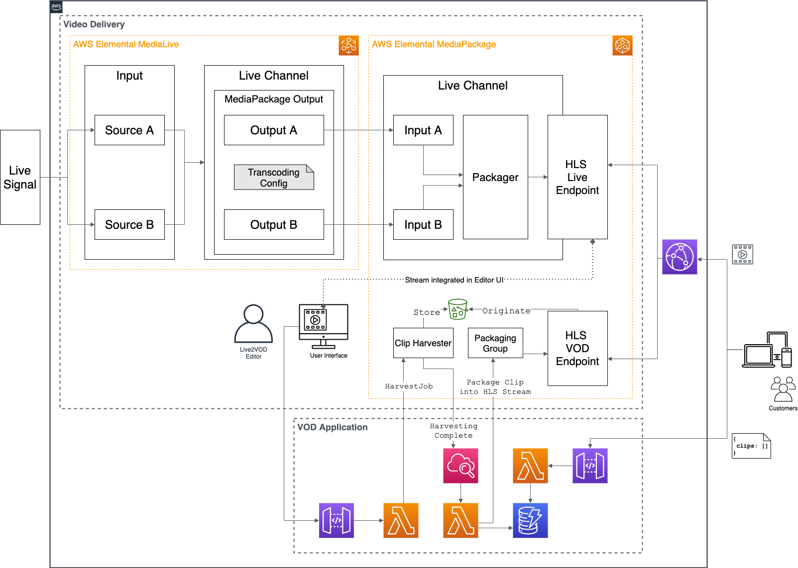

#  Creating a Live-to-VOD workflow using AWS Elemental Services and the AWS serverless platform

This repository contains the full source code that is used in the blog post [Create a serverless Live-to-VOD workflow with AWS Elemental](https://aws.amazon.com/blogs/architecture/field-notes-create-a-serverless-live-to-vod-workflow-with-aws-elemental/).

## Solution Overview





### Prerequisites

- An [AWS account](https://signin.aws.amazon.com/signin?redirect_uri=https%3A%2F%2Fportal.aws.amazon.com%2Fbilling%2Fsignup%2Fresume&client_id=signup)
- Installed and authenticated [AWS CLI](https://docs.aws.amazon.com/en_pv/cli/latest/userguide/cli-chap-install.html) (authenticate with an [IAM](https://docs.aws.amazon.com/IAM/latest/UserGuide/getting-started.html) user or an [AWS STS](https://docs.aws.amazon.com/STS/latest/APIReference/Welcome.html) Security Token)
- [AWS Serverless Application Model (AWS SAM)](https://docs.aws.amazon.com/serverless-application-model/index.html)
- You have completed steps 1-3 of the [AWS Live Streaming and Live-to-VOD Workshop](https://github.com/aws-samples/aws-media-services-simple-live-workflow) **or** already have an AWS Elemental MediaPackage live endpoint you want to extract clips from. You can check your existing endpoints using the following CLI command.

```
aws mediapackage list-origin-endpoints
```

### Let’s get you started

#### 1. Make sure you completed the prerequisites above and git pulled this repo.

```
git clone git@github.com:aws-samples/live-to-vod-workflow-using-aws-serverless-platform
```

#### 2. Open the repository in your preferred IDE and familiarize yourself with the code.

- `sam.yml` describes the AWS resources that make up your workflow.
- `handler.py` contains the Python code for our Lambda functions.
- `create_packaging_group.py` is a convenience script to create a packaging group.

#### 3. Create a deployment bucket for our code on S3.

```
aws s3 mb s3://<YOUR_BUCKET>
```

#### 4. Create a packing group and note the `PACKAGING_GROUP_ID`

```
python create_packaging_group.py <THE_ID_FOR_YOUR_PACKAGING_GROUP> <THE_ID_FOR_YOUR_PACKAGING_CONFIG>
```

i.e. 

```
python create_packaging_group.py MyPackagingGroupForVOD MyPackagingConfigForVODInHLS
```

#### 5. Create a SAM package of your application for deployment

```
sam package --template-file ./sam.yml --s3-bucket <YOUR_BUCKET>  --output-template-file ./packaged.yml
```

#### 6. Deploy your application

```
sam deploy --template-file packaged.yml --stack-name ServerlessLiveToVOD --capabilities CAPABILITY_NAMED_IAM --parameter-overrides ClipsOriginEndpointId=YOUR_ORIGIN_ID PackagingGroupId=YOUR_PACKAGING_GROUP_ID
```

If you are unsure about the values for `ClipsOriginEndpointId` and `PackagingGroupId` you can check the AWS console or use the following CLI commands

##### List Origin Enpoints

```
aws mediapackage list-origin-endpoints --query "OriginEndpoints[*].[Id]" --output table
```
##### List Packaging Groups+

```
aws mediapackage-vod list-packaging-groups --query "PackagingGroups[*].Id" --output table
```

After the deployment has been successful, SAM will output a parameter `API endpoint URL`. The value should look similar to this: `https://abcde.execute-api.eu-central-1.amazonaws.com/prod/` - this is your API endpoint, which you can now use to create clips from your live stream and query your clip database.

## Cleaning up

When you are done, make sure to clean everything up.
Run the following command to shut down the resources created in this workshop.

```
aws cloudformation delete-stack --stack ServerlessLiveToVOD
```

If you used the AWS Live Streaming and Live-to-VOD Workshop please follow the instructions to clean up the AWS Elemental resources if no longer needed.

## License

This library is licensed under the MIT-0 License. See the LICENSE file.

